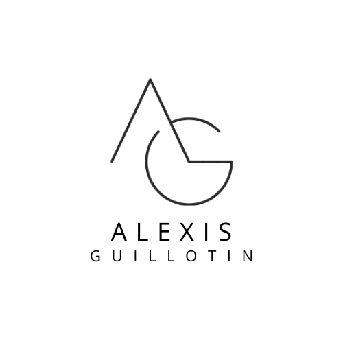

<h1 align="center"> Hi, I am Alexis Guillotin </h1>

  

---

<h3 align="center"> A french apprentice in Big Data & AI</h3>

- 👋 Hi, I’m <a href="https://github.com/alexisguillotin">@AlexisGuillotin</a>
- 👀 I like developping small project, alone or with others
- 🌱 I’m currently learning some AI algos and data frameworks
- 💞️ I’m collaborating with <a href="https://github.com/clementmariebrisson">@clementmariebrisson</a> and <a href="https://github.com/PierreBrunier">@PierreBrunier</a>
- 📫 Reach me at alexis.guillotin1@hotmail.com

